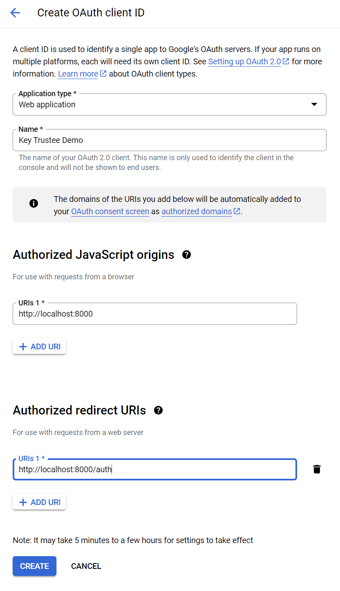
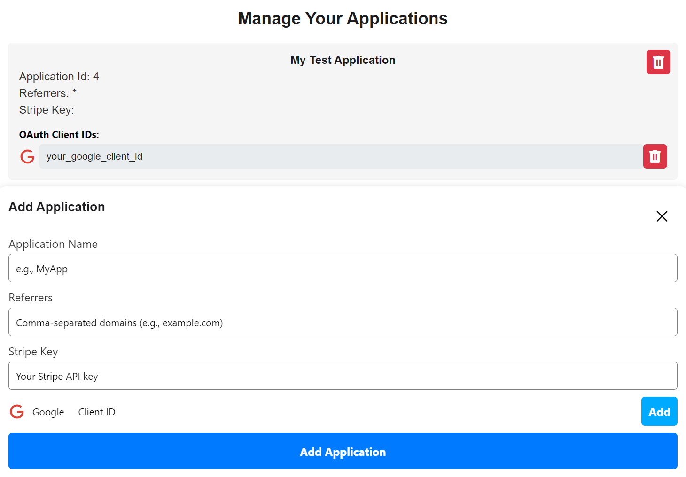

# Key Trustee Example Application

1. Create your  ([instructions](https://support.google.com/cloud/answer/6158849?hl=en)) google oauth client and configure the authorized javascript origin and redirect URI:



2. Register your demo application with Key Trustee:



3. Enable the model as a user:


4. Take the generated oauth client id and secret and add them to the `.env` file:

```
```

5. Run `$ python app.py` from the app directory.

6. Navigate to the [login page](http://localhost/login) and complete the oauth flow.  From here you will be able to chat with the model you selected in Key Trustee. 

