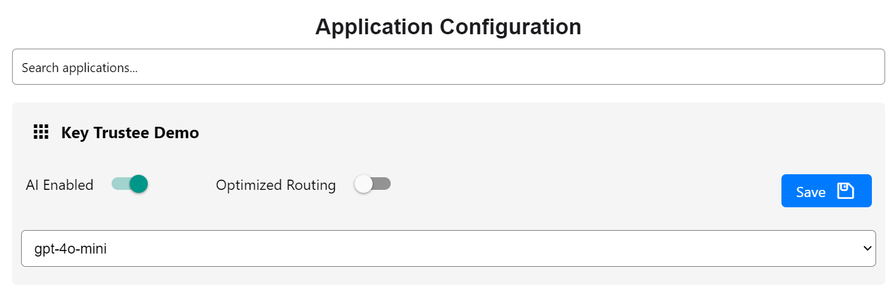

# Key Trustee Example Application

1. Create your  ([instructions](https://support.google.com/cloud/answer/6158849?hl=en)) google oauth client and configure the authorized javascript origin and redirect URI:


2. Register your demo application with Key Trustee:


3. Enable the model as a user:



4. Take the generated oauth client id and secret and add them to the `.env` file:

```
GOOGLE_CLIENT_ID=your_google_client_id
GOOGLE_CLIENT_SECRET=your_google_client_secret
```

5. Install Poetry if you haven't already:

`curl -sSL https://install.python-poetry.org | python3 -`

6. Install dependencies:

`poetry install`

7. Activate the virtual environment:

`poetry shell`

8. Run `$ python app.py` from the app directory.

9. Navigate to the [login page](http://localhost/login) and complete the oauth flow.  From here you will be able to chat with the model you selected in Key Trustee. 

